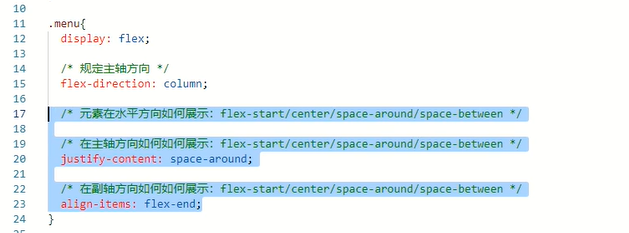

## day01微信小程序

### 1、准备

- 如何开发小程序
  - 小程序：学习微信开发的语言（前端html、css、js、vue.js) 
    - 微信开发者工具

  - API:Restful接口（Python + django +drf框架）
    - ​	Pycharm 

  

### 2、环境搭建

#### 2.1 Python 环境

- 虚拟环境
  - django  
    -  pip install django
  - drf  
    - PIP install djangorestframework
  
- pycharm

#### 2.2 小程序环境

##### 2.2.1 申请一个微信公众平台的账户 

- [微信公众平台](https://mp.weixin.qq.com/) 选择小程序,注册个人类型的会有部分功能被阉割

##### 2.2.2 保存自己的APPid

​	APPID = wx868dbda1f6d5cf05


[微信公众平台](https://mp.weixin.qq.com/)

邮箱：yunli_46@163.com

密码：YGR=520ws

##### 2.2.3 微信小程序目录


每一个页面都在 **page** 目录下有一个文件夹，每一个页面都有四个文件。  


### 3、开发小程序 

#### 3.1全局配置

[官方文档](https://developers.weixin.qq.com/miniprogram/dev/framework/)

- pages
- windows


#### 3.2 组件

##### 3.2.1 text

​		类似于 span,编写文本

##### 3.2.2 view

​		容器，类似于 dIV

##### 3.2.3 image

​		图片

##### 3.3 小程序特有的样式

- px
- rpx
- 

### 4、 fiex 布局

​		所有的html都有的布局模式。 一种非常方便的样式

​		在容器中记住4个样式即可




案例

 


### 5、作业

​	https://www.bilibili.com/video/BV13f4y1j7NB?p=8&spm_id_from=pageDriver

- 首页
- 拍卖页
- 消息页
- 个人信息页面


### 7、颜色

```
我的：
	顶部：#00B6B8
	线条：#F7F7F7

```


MPI  QWEB  


### 6、**容器属性 ** Flex 布局教程：语法篇

​	[Flex 布局教程：语法篇]()

- flex-direction

  - 决定主轴的方向（即项目的排列方向）

    - ```css
       flex-direction: row | row-reverse | column | column-reverse;
      ```

- flex-wrap

  - 项目换行，默认是在一条线上。

    - ```css
       flex-wrap: nowrap | wrap | wrap-reverse;
      ```

- flex-flow

  - 是`flex-direction`属性和`flex-wrap`属性的简写形式，默认值为`row nowrap`。

    - ```css
      flex-flow: <flex-direction> || <flex-wrap>;
      ```

- justify-content

  - 定义了项目在主轴上的对齐方式。

    - ```css
      justify-content: flex-start | flex-end | center | space-between | space-around;
      ```

- align-items

  - 定义项目在交叉轴上如何对齐。

    - ```css
      align-items: flex-start | flex-end | center | baseline | stretch;
      ```

- align-content

  - 定义了多根轴线的对齐方式。如果项目只有一根轴线，该属性不起作用。

    - ```css
       align-content: flex-start | flex-end | center | space-between | space-around | stretch;
      ```

**项目属性**

- `order`

  - 定义项目的排列顺序。数值越小，排列越靠前，默认为0。

    - ```css
       order: <integer>;
      ```

- `flex-grow`

  - 定义项目的放大比例，默认为`0`，即如果存在剩余空间，也不放大。

    - ```css
        flex-grow: <number>; /* default 0 */
      ```

- `flex-shrink`

  - 定义了项目的缩小比例，默认为1，即如果空间不足，该项目将缩小

    - ```css
       flex-shrink: <number>; /* default 1 */
      ```

- `flex-basis`

  - 定义了在分配多余空间之前，项目占据的主轴空间（main size）。浏览器根据这个属性，计算主轴是否有多余空间。它的默认值为`auto`，即项目的本来大小。

    - ```css
      flex-basis: <length> | auto; /* default auto */
      ```

- `flex`

  - 是`flex-grow`, `flex-shrink` 和 `flex-basis`的简写，默认值为`0 1 auto`。后两个属性可选。

    - ```css
       flex: none | [ <'flex-grow'> <'flex-shrink'>? || <'flex-basis'> ]
      ```

- `align-self`

  - 允许单个项目有与其他项目不一样的对齐方式，可覆盖`align-items`属性。默认值为`auto`，表示继承父元素的`align-items`属性，如果没有父元素，则等同于`stretch`。

    - ```css
       align-self: auto | flex-start | flex-end | center | baseline | stretch;
      ```


[微信小程序页面跳转方法 - 知乎 (zhihu.com)](https://zhuanlan.zhihu.com/p/69107487)


### git


```c
取消全局代理：
git config --global --unset http.proxy

git config --global --unset https.proxy


设置代理
git config --global http.proxy http://127.0.0.1:1080

git config --global https.proxy http://127.0.0.1:1080

修改设置，解除ssl验证
git config --global http.sslVerify "false"

取消本次的commit
git reset --soft HEAD^
    	HEAD^  表示上一次的commit，也可以写成HEAD~1
```


## day 02

### 内容回顾

- 搭建环境
- 全局配置
  - pages
  - window
  - tarbar
- 页面
  - json
  - js
  - wxml
  - wxss
- flex 布局
  - display
  - flex-direction
  - justify-content
  - align-item
- 小程序开发
  - 组件（标签）
    - text
    - view
    - image
  - 样式
    - rpx

### 今日概要

- 指令
- api
- 页面


### 今日内容

#### 1、跳转


data {} 中存储是 key: vlue 键值对的数据

其他方法中存储的是变量，需要使用 = 进行赋值 


[微信小程序之顶部导航栏（选项卡）实例 —— 微信小程序实战系列（1）](https://blog.csdn.net/michael_ouyang/article/details/56488665)


https://developers.weixin.qq.com/miniprogram/dev/framework/


#### 12个月份的古称

```
玄天色	
一月.孟春 
	昨夜斗回北，今朝岁启东
	
栀子色
二月.花朝
	雨晴烟晚，绿水新池满

苏梅色
三月.桃色
	春日游.杏花吹满头

水龙呤
	四月.槐夏
	春已归来，看美人头上，袅袅春幡
	
石榴裙
	五月.仲夏
	小扇引微凉，悠悠夏日长
	
夕岚色
	六月.荷月
	微雨过，小荷翻，榴花开欲然
	
白露降
	七月.上秋
	银烛秋光冷画屏，轻罗小扇扑流萤
	
桂花香
	八月.清秋
	夜雨做成秋，恰上心头

棠梨花	
	九月.桑落
	菊花煮酒，落叶研磨，却道天凉好个秋

胭脂水
	十月.霜华
    无言独上西楼月如钩，寂寞梧桐深院锁清秋
    
明茶褐
	十一月.隆冬
	柴门为犬吠，风雪夜归人
	
青玉白
	十二月.暮岁
	一岁一礼，一寸欢喜
	

```

